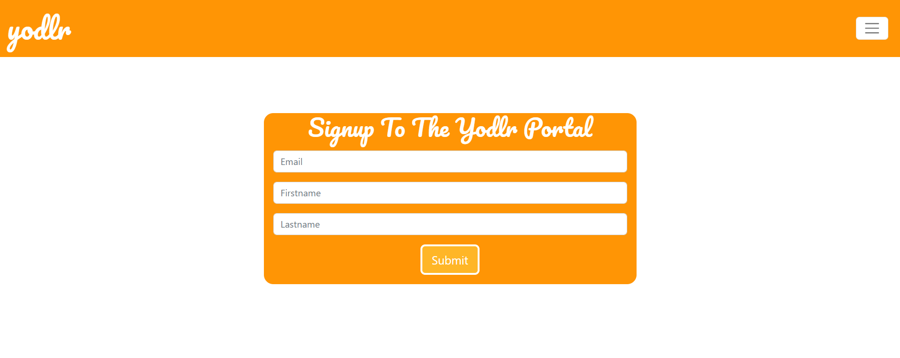
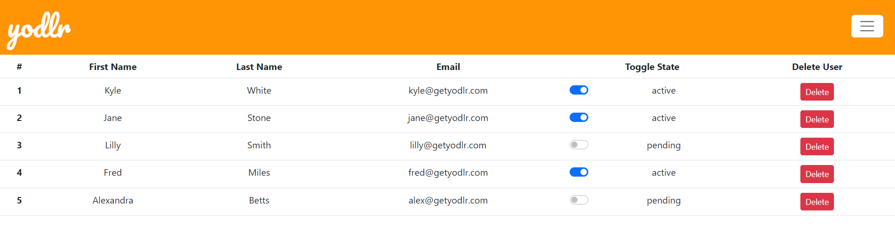

# Yodlr Frontend Take Home Challenge



## Description: 

This was a mock take home challenge where I was provided a backend directory that was made with Express and a JSON store database. 

The challenge was to create a simple registration page and an admin page that showed all users. For more details, read the [backend read me](https://github.com/pasha-log/yodlr-take-home-challenge/blob/main/yodlr-backend/README.md).



This project was bootstrapped with [Create React App](https://github.com/facebook/create-react-app).

## Other Tools Used:

* Reactstrap/Bootstrap
* React Hook Forms 
* React Router Dom

## Available Scripts

Open two separate windows in the terminal and ```cd``` into files fors backend and frontend separately.
To activate each file, you can run:

### `npm start`

Runs the app in the development mode.
Open ```http://localhost:3000``` to view backend in your browser.
Open ```http://localhost:3001``` to view frontend in your browser.
